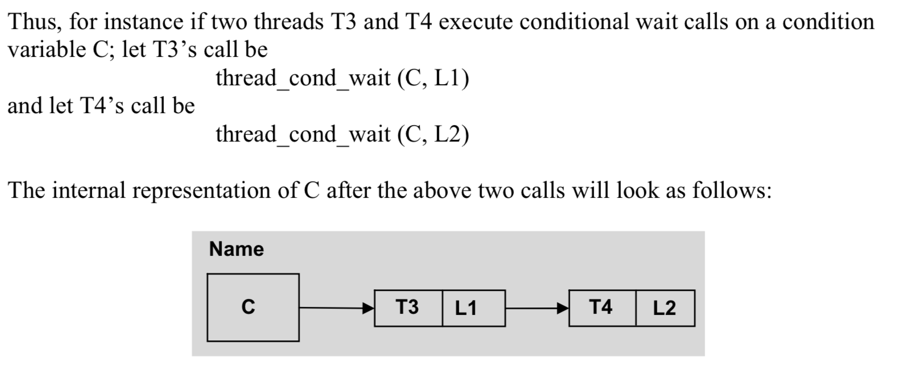
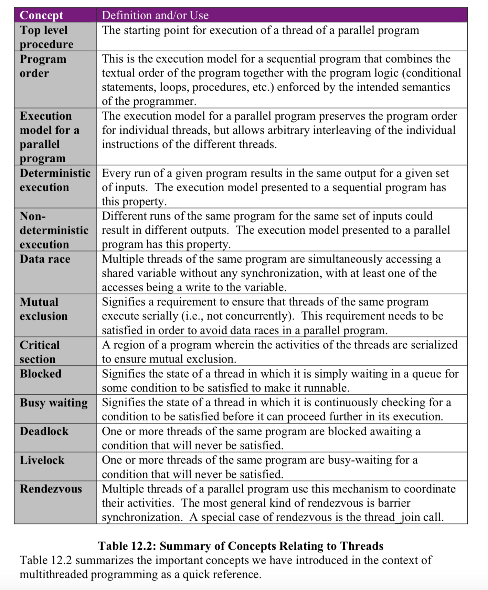
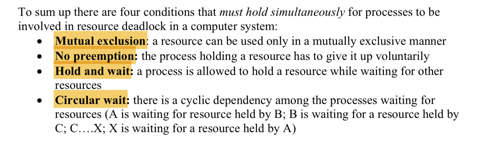
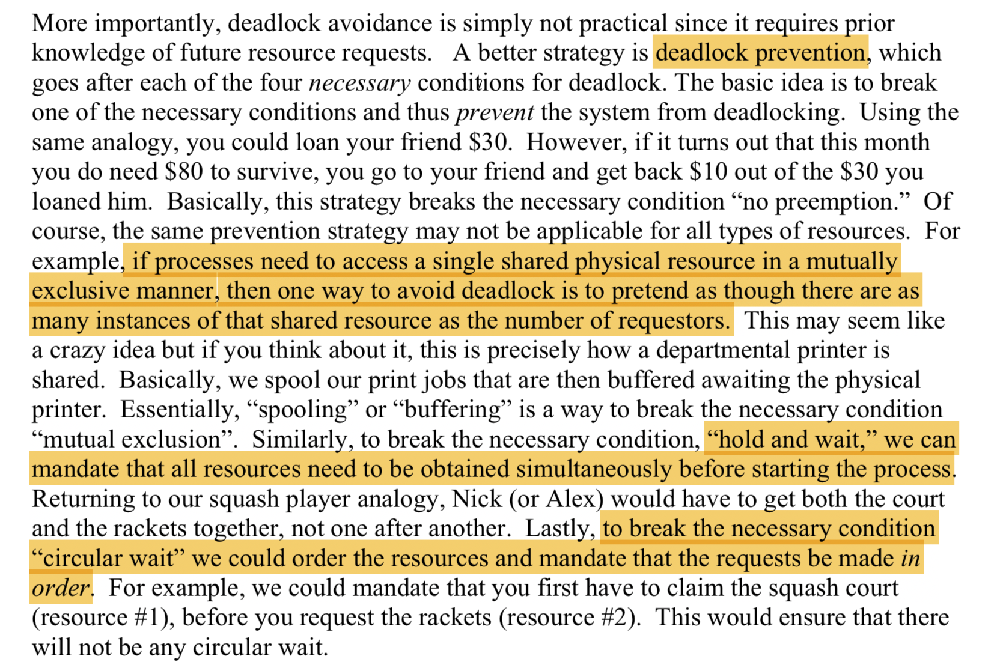

### Diffrence Between Multi-Thread and Process

- Memory Space: Process has its own memory space, Threads are in a single memory space
	- code
	- global data
	- heap
	- stack

	
### Concept Intro:	
- Read/Write Conflict: Multiple threads try to visit same variable and at least one thread is writing this variable.
- Racing condition: 
	- on purpose for synchronization, the vairable in synchronization variable
	- not on purpose, data racing
- Greedy, data racing:
	- Instructions in ISA are atomic, but it cannot ensure the uninterrupted procedure of ld, add, st.
	- non-deterministic

### Mutex (Mutual Exclusion)
_**General**_

```
mutex_lock_type mylock;
thread_mutex_lock(mylock);
thread_mutex_unlock(mylock);
```
if mylock is currently used by another thread_b, thread_a can't get mylock. Thread_a will be blocked.

- blocked: thread cannot be continued until some condition is met.
Ex: Producer and Consumer

```
mutex_lock_type bufferlock;
item_type buffer;
producer() {
	item_type item;
	/*code to produce*/
	thread_mutex_lock(bufferlock);
		buffer = item;
	thread_mutex_unlock(bufferlock);
}

consumer() {
	item_type item;
	thread_mutex_lock(bufferlock);
		item = buffer;
	thread_mutex_unlock(bufferlock);
	/*code to consume item*/
}
```

_**Unblocked mutex**_

```
{success, failure} <- thread_mutex_trylock(mylock);
```
### Rendezvous

```
thread_join(peer_thread_id);
```
parent_thread(main_thread) has to wait all child threads to finish

```
int main() {
	int f;
	thread_type child_tid;
	child_tid = thread_create(foo, &f);
	/*....*/
	thread_join(child_tid);
}
```

Ex, digiterlizer and tracker:

_**Naive Vesion**_:

```
/*shared variable*/
#define MAX 100
image_type buffer[MAX];
int bufferavail;
mutex_type availock;

digitizer()
{
	image_type image;
	int tail = 0;
	grad(image);
	while (bufferavail == 0)
		do nothing;
	buffer[tail] = image;
	tail = (tail + 1) % MAX;
	thread_mutex_lock(availock);
		bufferavail = bufferavail - 1;
	thread_mutex_unlock(availock);
}

tracker()
{
	image_type image;
	int head = 0;
	while (bufferavail == MAX)
		do nothing;
	image = buffer[head];
	head = (head + 1) % MAX;
	thread_mutex_lock(availock);
		bufferavail = bufferavail + 1;
	thread_mutex_unlock(availock);
	analyze(image);
}
```

_**More Efficient Version**_:

_Condition variable date type_:


```
/*shared variable*/
#define MAX 100
image_type buffer[MAX];
int bufferavail;
mutex_type bufferlock;
thread_cond_type buffer_not_empty;
thread_cond_type buffer_avail;

digitizer()
{
	image_type image;
	int tail = 0;
	grad(image);
	
	thread_mutex_lock(bufferlock);
		if (bufferavail == 0) {
			thread_cond_wait(buffer_avail, bufferlock);
		}
	thread_mutex_unlock(bufferlock);
	
	buffer[tail] = image;
	tail = (tail + 1) % MAX;
	
	thread_mutex_lock(availock);
		bufferavail = bufferavail - 1;
		thread_cond_signal(buffer_not_empty);
	thread_mutex_unlock(availock);
}

tracker()
{
	image_type image;
	int head = 0;
	
	thread_mutex_lock(bufferlock);
		if (bufferavail == MAX) {
			thread_cond_wait(buffer_not_empty, bufferlock);
		}
	thread_mutex_unlock(bufferlock);
	
	image = buffer[head];
	head = (head + 1) % MAX;
	
	thread_mutex_lock(bufferlock);
		bufferavail = bufferavail + 1;
		thread_cond_signal(buffer_avail);
	thread_mutex_unlock(bufferlock);
	analyze(image);
}
```
_**Multiple threads call**_:

Multiple threads call use_shared_resourse procedure:
Need to re-check predicate (ex. res-state == BUSY) to avoid conflict

```
enum state_t {BUSY, NOT_BUSY} res_state = NOT_BUSY;
cond_var_type res_not_busy;
mutex_lock_type cs_mutex;

acquire_shared_resource()
{
	thread_mutex_lock(cs_mutex);
		while (res_state == BUSY) {
			thread_cond_wait(res_not_busy, cs_mutex);
		}
		res_state = BUSY;
	thread_mutex_unlock(cs_mutex);
}

release_shared_resource()
{
	thread_mutex_lock(cs_mutex);
		res_state = NOT_BUSY;
		thread_cond_signal(res_not_busy);
	thread_mutex_unlock(cs_mutex);
}

use_shared_resource()
{
	acquire_shared_resource();
		process_resource();
	release_shared_resource();
}
```

Modification for digitizer and tracker:

```
/*shared variable*/
#define MAX 100
image_type buffer[MAX];
int bufferavail;
mutex_type bufferlock;
thread_cond_type buffer_not_empty;
thread_cond_type buffer_avail;
int head = 0;
int tail = 0;
mutex_type headlock;
mutex_type taillock;

digitizer()
{
	image_type image;
	grad(image);
	
	thread_mutex_lock(bufferlock);
		while (bufferavail == 0) {
			thread_cond_wait(buffer_avail, bufferlock);
		}
	thread_mutex_unlock(bufferlock);
	
	thread_mutex_lock(taillock);
		buffer[tail] = image;
		tail = (tail + 1) % MAX;
	thread_mutex_unlock(taillock);
	
	thread_mutex_lock(availock);
		bufferavail = bufferavail - 1;
		thread_cond_signal(buffer_not_empty);
	thread_mutex_unlock(availock);
}

tracker()
{
	image_type image;
	
	thread_mutex_lock(bufferlock);
		while (bufferavail == MAX) {
			thread_cond_wait(buffer_not_empty, bufferlock);
		}
	thread_mutex_unlock(bufferlock);
	
	thread_mutex_lock(headlock);
		image = buffer[head];
		head = (head + 1) % MAX;
	thread_mutex_unlock(headlock);
	
	thread_mutex_lock(bufferlock);
		bufferavail = bufferavail + 1;
		thread_cond_signal(buffer_avail);
	thread_mutex_unlock(bufferlock);
	analyze(image);
}
```

Concept Sum Table:


DeadLock Condition:

DeadLock Prevention:



